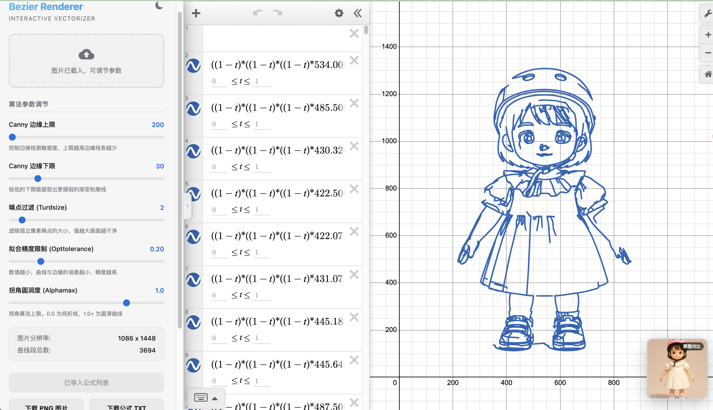

# Desmos Bezier Renderer | 交互式图像矢量化调优平台

这是一个可以将普通位图图片，一键实时边缘提取并无损转化为 Desmos 计算器中贝塞尔曲线（Bezier Curves）公式的交互式前端系统。它具备高颜值的控制侧栏，支持滑块微调各项拟合参数，并在内置的 Desmos 中实时无闪烁展现矢量化轮廓。


---

## ✨ 核心特性

* **🎬 贝塞尔曲线动态逐步模拟绘制（首要推荐）**：
  * **拟人化笔触动效**：系统不仅支持一键载入全部公式，更内置了“一笔一画”的动态重绘仿真算法，能够像写字画画一样，优雅地在 Desmos 中动态生长和勾勒出整张图画。
  * **绘制速度实时可调**：控制面板支持在 `1ms` 到 `150ms` 之间精细调节画笔步进频率，满足高速回放或艺术感十足的慢速“现场画画”展示需求。
  * **左侧公式栏自动翻滚与聚焦高亮**：在播放绘制时，左侧的 Desmos 表达式栏会**同步高亮显示**当前正在落笔绘制的那一行 LaTeX 贝塞尔公式，且公式栏会自动平滑地向下滑动滚动，使当前正在绘制的方程式始终聚焦在屏幕视野中心，充满机械与艺术结合的动感！
  * **播放状态全掌控**：支持随时“暂停/继续”绘制，或“一键重置”清空画布重新播放。
* **📂 交互式拖拽上传**：摒弃复杂的后台文件夹批处理，支持直接在网页端拖放或点击上传任意图片（JPG / PNG 等）。
* **🎛️ 实时参数调优**：
  * **Canny 边缘敏感度**：精准把控图像的线条轮廓提取粗细。
  * **噪点过滤 (Turdsize)**：剔除细小的噪波斑点，让图像极度干净。
  * **精度控制 (Opttolerance)**：调节公式贴合边缘的紧密程度，数值越小拟合越细腻，线条越丝滑！
  * **转角平滑度 (Alphamax)**：控制锐利折角与圆润曲线的过渡策略。
* **💾 高清图片与公式下载**：
  * **无损线条图 PNG**：一键调用 Desmos 高级截图 API，秒级导出 `1920x1080` 的高清线条 PNG。
  * **公式文本 TXT**：一键打包下载全部生成的 LaTeX 贝塞尔公式列表，便于离线保存与共享。
* **🌓 全局白天/黑夜主题同步**：支持白天（雾霾白）/黑夜（磨砂黑）一键切换，并同步让右侧 Desmos 画布反色，实现极致的黑白视觉统一。
* **⬅️ 侧边栏折叠拉伸**：点击隐藏胶囊按钮即可将侧边栏向左滑移滑出，Desmos 容器平滑拉伸且网格完全对齐重绘。
* **📷 右下角原图悬浮比对**：右下角提供原图卡片及模态大图比对弹窗，方便微调过程中核对图线细节。



---

## 🛠️ 本地一键启动（推荐）

我们在项目根目录下编写了全自动配置和启动脚本。无论您使用的是 **macOS** 还是 **Linux / Windows WSL** 系统，您只需在终端中运行以下一句话命令即可：

```sh
# 赋予执行权限并运行一键脚本
chmod +x run.sh && ./run.sh
```

### 💡 脚本会自动帮您完成：
1. **自动检测系统类型**：并全自动使用 `brew`（Mac）或 `apt`（Linux/WSL）安装所需的系统底层依赖 `potrace`（若已安装则跳过）。
2. **自动创建并激活 Python 虚拟环境**（`env`）。
3. **自动安装升级 pip，并拉取安装 `requirements.txt` 内的所有 Python 包**。
4. **全自动拉起 Flask 后端服务，并自动打开您的默认浏览器**，直达主页面！

---

## 📦 手动配置与运行步骤（备用）

如果您倾向于手动执行或脚本在您的非标准环境下遇到障碍，请按以下步骤手动配置：

### 1. 安装系统依赖 `potrace`
* **macOS**：`brew install potrace`
* **Linux / WSL**：`sudo apt-get update && sudo apt-get install -y libpotrace-dev`

### 2. 创建并激活虚拟环境
```sh
python -m venv env
source env/bin/activate  # macOS / Linux / WSL
# Windows PowerShell 运行: .\env\Scripts\Activate.ps1
```

### 3. 安装依赖包并运行
```sh
pip install -r requirements.txt
python backend.py
```
运行后在浏览器中访问：👉 **`http://127.0.0.1:5000/calculator`**

现在，您可以尽情拖入本地的图片进行矢量化公式拟合了！

---

## 🔧 拟合精度调优秘籍

如果您希望生成的线条图能够完美契合原图并达到极高的精度，请遵循以下调节技巧：
1. **优先将 “精度控制 (Opttolerance)” 调小**：将其从默认的 `0.20` 降到 **`0.05` 甚至 `0.02`**，曲线会呈爆发式细致，线条会完全紧贴像素点边缘。
2. **调小 “噪点过滤 (Turdsize)”**：将其降低到 `0` 或 `1`，系统会保留更细小的微弱折线和零碎的边缘轮廓细节。
3. **调优 Canny 阈值**：将“Canny 边缘下限”调小，系统会检测到更浅的色彩明暗变化边缘；上限越高，非主干边缘越容易被过滤。
4. **图片前处理**：推荐先用 AI 放大算法或图像工具把输入图片的分辨率扩大 2~3 倍后再进行上传，越致密的分辨率，拟合出的贝塞尔 LaTeX 参数曲线效果越逼真、越流畅。

---

## 📦 macOS APP 独立打包 (可选)
如果您希望为非开发者用户打包一个双击即用的 macOS `.app` 包，只需在虚拟环境下运行：
```sh
pip install pyinstaller
pyinstaller --noconfirm --onedir --windowed --name "DesmosBezierRenderer" --hidden-import "potrace.bezier" --hidden-import "potrace.agg" --hidden-import "potrace.agg.curves" --add-data "frontend:frontend" backend.py
```
编译成功后，将在 `dist/` 文件夹下生成 **`DesmosBezierRenderer.app`**，直接拷贝到任意 Mac 上即可直接双击运行！

---

## ⚖️ 授权协议 (Copyright & EULA)

©Copyright Junferno 2021-2023. 本项目遵循 [GNU General Public License](https://github.com/kevinjycui/DesmosBezierRenderer/blob/master/LICENSE) 开源许可协议。

使用本软件即代表您同意并遵守 [Desmos 使用条款](https://www.desmos.com/terms)。本软件及相关文档“按原样”提供，不附带任何形式的明示或暗示保证。开发者真诚要求用户**不要将本工具用于各类 Desmos 数学艺术设计竞赛**，以维护竞赛的公正性与诚实性。
